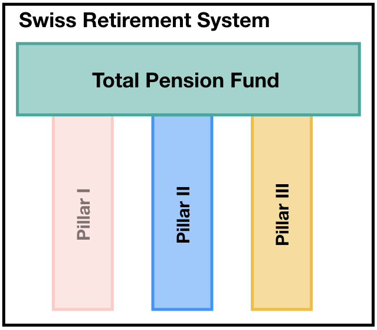

## What:

<div class="row">
<div class="column2">
<div style="margin-top:30px;">

</div>
</div>
<div class="column7">
**SmaRP: Smart Retirement Planning** is a pension calculator tool, designed to guide people working in Switzerland towards a strategic decision-making process for their retirement.
</div>
</div>

**SmaRP** is based on the [Swiss pension system](https://en.wikipedia.org/wiki/Pension_system_in_Switzerland) and reflects the complexity of its legal framework.

**User Interface:**

* Developed with [R Shiny](https://shiny.rstudio.com/) 
* Flexible & Intuitive
* Detailed personalisation parameters

## Swiss Pension System

<div class="row">
<div class="column">

</div>
<div class="column6>
* **Pillar I:** pay-as-you-earn state-run fund.
* **Pillar II:** compulsory, tax-deductible company occupational pension insurance fund.
* **Pillar III:** voluntary contribution, privately-run, tax-deductible insurance fund.
</div>
</div>
<div style="margin-top:20px;">

</div>

## Swiss Tax by Municipality

Here goes the map of Switzerland

## |

<div class = "extendediframe" >
```{r SmaRP-app, echo = FALSE}
source(system.file("application","global.R", package = "SmaRP"))
shinyAppDir(
  system.file("application", package = "SmaRP"),
  options = list(
    width = "120%", height = 1000
  )
)
```
</div>
