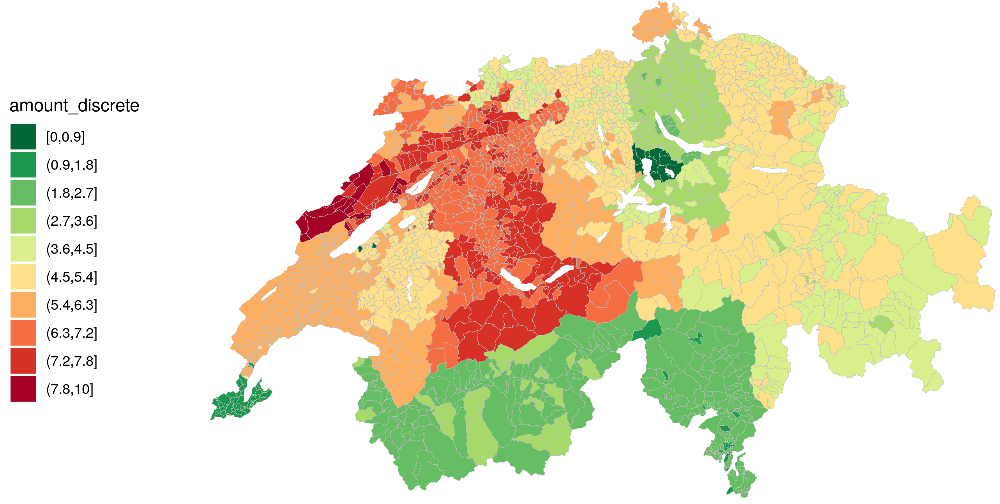

## Swiss Pension System

<div class="row">
<div class="column">

</div>
<div class="column6>
* **Pillar I:** pay-as-you-earn state-run fund.
* **Pillar II:** compulsory, tax-deductible company occupational pension insurance fund.
* **Pillar III:** voluntary contribution, privately-run, tax-deductible insurance fund.
</div>
</div>
<div style="margin-top:20px;">

</div>

## Swiss taxes by municipality

<div class="row">
<div class="column6">
<div style="margin-top:-100px;">

</div>
</div>
<div class="column3", style = "font-size: 12pt;line-height: 1.5;margin-top:370px; margin-left: 60px;">
`ggplot2` plot made with SmaRP data for a 40-years old person, married, with two childern and affiliated to a church.
</div>
</div>

## The Problem

People working in Switzerland have a very hard time identifying a strategic and educated decision-making process for their retirement.

* The Swiss pension system is complex
* Pension fund calculation dependent on multiple parameters to be realistic
* Currently available tools provide projections without disclosing the methodology and the assumptions
* No easy way to model different scenario


## The Solution

<div class="row">
<div class="column2">
<div style="margin-top:30px;">

</div>
</div>
<div class="column7">
**SmaRP: Smart Retirement Planning** is a pension calculator tool, designed to guide people working in Switzerland towards a strategic decision-making process for their retirement.
</div>
</div>

**SmaRP** is based on the [Swiss pension system](https://en.wikipedia.org/wiki/Pension_system_in_Switzerland) and reflects the complexity of its legal framework.

**User Interface:**

* Developed with [R Shiny](https://shiny.rstudio.com/) 
* Flexible & Intuitive
* Detailed personalisation parameters


## |

```{r SmaRP-app1, echo = FALSE}
source(system.file("application","global.R", package = "SmaRP"))
shinyAppDir(
  system.file("application", package = "SmaRP"),
  options = list(
    width = "100%", height = 1000
  )
)
```
