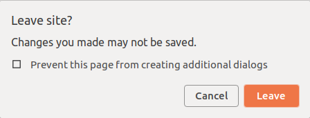

## SmaRP Functionalities

At its core, **SmaRP** consists of few main functionalities:

* evaluate the <font style="color: #008cc3; !important;">contribution & returns for  Pillar II</font> yearly untill retirement (`buildContributionP2Path()`)
* calculate the <font style="color: #008cc3; !important;">contribution  & returns for Pillar III</font>  yearly untill retirement (`buildContributionP3path()`)
* estimate <font style="color: #008cc3; !important;">tax benefits</font> for  & returns for to Pillar II and Pillar III yearly untill retirement (`buildTaxBenefits()`)

## SmaRP Inputs

The corresponding functions require a set of parameters:

* **Pillar II** : current salary & expected growth rate, current Pillar II assets, amount & type of voluntary purchases of Pillar II, interest rate.

* **Pillar III** : current Pillar III assets, annual contributions and expected return.

* **Personal information for tax estimate**: birthdate, retirement age (gender dependent), marital status, number of children, church affiliation and municipality of residence.

## Need of an User Interface

Providing many input parameters and having to post-process the results manually is not convenient, especially for sensitivity and 'what if?' analyses.

<!-- Having a graphical user interface with some basic interpretation of the results (e.g. plots) makes the functionality more accessible. -->

R offers a great tool to add a UI to the code: [R Shiny](https://shiny.rstudio.com/)

- framework to develop interactive web applications directly in R
- exploits R computational power
- no need of knowing any HTML, CSS or JavaScript

<div style="margin-top:30px;margin-right:30px;">

</div>

## Shiny

Shiny is an R package and can be downloaded from [CRAN](https://cran.r-project.org/). 
It is developed by RStudio and integrates well with RStudio IDE.

A shiny app presents the following structure:

```{r intro-shiny-app-structure, eval = FALSE, echo = TRUE}
library(shiny)
ui <- fluidPage(
  # input and output widgets
)
server <- function(input, output) {
  #Reactive code to produce the results
}
shinyApp(ui = ui, server = server)
```

## Shiny Input Widgets

Shiny provides R code that returns the HTML equivalent of many widgets. For example:

```{r intro-shiny_ui_as_html1, echo = TRUE, eval = TRUE}
numericInput(
  "RetirementAge",
  label = NULL,
  value = 64,  step = 1,
  min = 55,  max = 70 
)
```

In **SmaRP**  multiple types of widgets are used, e.g. `numericInput`, `radioButton`, `checkboxInput`, `panel` etc.

For a complete overview of shiny widgets have a look at the [Widgets Gallery](https://shiny.rstudio.com/gallery/widget-gallery.html).

## |

```{r SmaRP-app2, echo = FALSE}
source(system.file("application","global.R", package = "SmaRP"))
shinyAppDir(
  system.file("application", package = "SmaRP"),
  options = list(
    width = "100%", height = 1000
  )
)
```

## Custom your Shiny App - HTML, CSS

A shiny app is fundamentally `HTML` based. Therefore it is possible to customise it with `HTML` code, `css` personalisation, and `JavaScripts`.

```{r css-style-echo, echo = TRUE, eval = FALSE}
tags$head(
  tags$style(HTML("
    a { color: #008cc3;}"))),
  a(id = "git-footer",
    href = "https://github.com/miraisolutions/SmaRP.git",
    target = "_blank", icon("github-square", "fa-2x"))
```

```{r css-style-out, echo = FALSE}
fluidRow(
  tags$head(
    tags$style(HTML("
    a { color: #008cc3;}"))),
  div( style = "margin-left: 50px; margin-top: 20px; margin-bottom: 20px;",
       a(id = "git-footer",
         href = "https://github.com/miraisolutions/SmaRP.git",
         target = "_blank", icon("github-square", "fa-2x")))
)
```

**SmaRP** has its own customisation for colors, boxes, tabs etc. in a `style.css` file that is passed as an input to the app.

## Custom your Shiny App -JavaScript

It is also possible to pass `JavaScript` to a shiny app.

For example, in **SmaRP** a `JavaScript` is called in the `ui` to prevent accidental log out.

```{r javascript, eval = FALSE, echo = TRUE}
tags$script('window.onbeforeunload = function(event) {return "";};')
```

The script opens a browser pop-up window which asks for confirmation to leave the page.

<div style="margin-top:30px;">

</div>

## Custom your Shiny App - External Packages

Shiny is widely used in the community and a variety of packages have been released that:

- supply additional customised widgets (e.g. `ShinyWidgets`)
- provide some useful Bootstrap components (e.g. `bsplus`)
- integrate JavaScript actions (e.g. `shinyjs`)
- improve table outlook (e.g. `DT`)

And many more.

Such packages can be used to make personalised and beautiful apps. For examples of shiny apps visit the [Shiny Gallery](https://shiny.rstudio.com/gallery/) website.


## External Packages in SmaRP - bsplus

**SmaRP** uses the tooltips from `bsplus` to support the user.

```{r tooltip-echo, echo = TRUE, eval = FALSE}
radioButtons(inputId = "rate_group",
             label = strong("Marital Status") %>%
               bsplus::bs_embed_tooltip(title = IB$rate_group, placement = "right"),
             inline = TRUE,
             choices = Rate_group.list,
             selected = "A")
```
```{r tooltip-out, echo = FALSE, eval = TRUE}
source(system.file("application","global.R", package = "SmaRP"))
div(style = "width: 600px !important;",
    radioButtons(inputId = "rate_group",
             label = strong("Marital Status") %>%
               bsplus::bs_embed_tooltip(title = IB$rate_group, placement = "right"),
             inline = TRUE,
             choices = Rate_group.list,
             selected = "A")
    )
```

## External Packages in SmaRP - shinydashboardPlus

**SmaRP** uses the collapsable boxes provided by `shinydashboardPlus`.

```{r boxplus-echo, echo = TRUE, eval = FALSE}
shinydashboardPlus::boxPlus(
  title = "Private Pension Fund - Pillar III",
  status = "primary", collapsible = TRUE,
  collapsed = TRUE,
  enable_dropdown = TRUE,
  numericInput(inputId = "CurrentP3", label = "Current Assets", ...),
  numericInput(inputId = "P3purchase", label = "Annual Contribution", ...)
) 
```

```{r boxplus-out, eval = TRUE, echo = FALSE, message=FALSE}
source(system.file("application","global.R", package = "SmaRP"))
ui <- fluidPage(
  shinyWidgets::useShinydashboardPlus(),
  tags$head(tags$style(HTML(
"
.box.box-primary {
  border-color: #FF9966;
}
.box-header .box-title {
  color: black;
  font-size: 13px;
  font-weight: bold;
}
.box-header > .box-tools {
  /* collapse icons vertical position */
  top: 3px;
}
"))),
  fluidRow(
          shinydashboardPlus::boxPlus(
            title = "Private Pension Fund - Pillar III",
            status = "primary",
            collapsible = TRUE,
            collapsed = TRUE,
            width = 12,
            closable = FALSE,
            dropdown_icon = NULL,
            enable_dropdown = TRUE,
            fluidRow(
              column(
                12,
                numericInput("CurrentP3",
                             label = "Current Assets",
                             value = 50000,
                             step = 1000,
                             min = 0
                )
                )
            ),
            fluidRow(
              column(
                12,
                numericInput("P3purchase",
                             label = "Annual Contribution",
                             value = 0,
                             step = 500,
                             min = 0
                )
              )
            )
          ) # end Pillar III boxPlus
        ) # end Pillar III fluidRow
)
server <- function(input, output) {
  #Code to produce the results
}
shinyApp(ui = ui, server = server)
```

<!-- <div style="margin-top:10px;"> -->
<!--  -->
<!-- </div> -->
