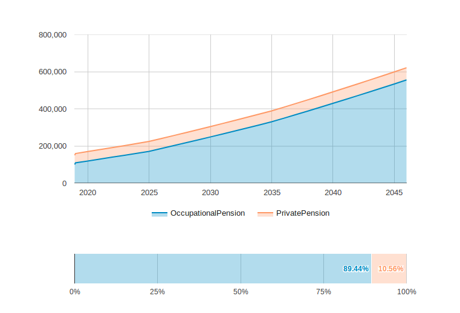

```{r setup, include = FALSE}
knitr::opts_chunk$set(
  collapse = TRUE,
  comment = "#>"
)

library(shiny)
suppressPackageStartupMessages(library(googleVis))
library(dplyr, warn.conflicts = FALSE)
library(magrittr)
```

```{r, echo=FALSE}
htmltools::img(src = knitr::image_uri("figures/mirai.png"), 
               alt = 'logo', 
               style = 'position:absolute; top:0; right:0; padding:10px; margin-right:200px; max-height: 40px;border-style: none;')
```

## Introduction

```{r child = 'children/short-intro.Rmd'}
```

This vignette describes the server components and their inner-workings. It is programmed using shiny basic package, googleVis, dplyr, magrittr packages and intended to be used with the mere support of a web browser. In addition to theoretical explanations, a few examples of code are included; for the full version please check the server.R file.  

## Outline

The server includes: reactive variables, Mirai Solutions colors definition, plots and statements. All reactive variables are obtained using input values from the ui and are then used to create plots and statements. These last two are rendered using functions from different packages.

## Reactive variables 

All inputs from the ui are then used to perform calculations, draw plots and write statements. Because these values are different for each user, the app will have to be constantly updated, thus the need for reactive statements. A simple example of a reactive statement is the one for the gender, which can be found in the server:

```{r, eval = FALSE} 
gender <- reactive({
  validate(need(input$gender, VM$gender))
  input$gender
})
```
where,

need is a shiny function that takes in an expression (`input$gender`) and a string (`VM$gender`). If the expression is not valid, the string is used as an error message
validate throws a specific type of error that stops the reactive expression execution in case of an error

Other reactive expressions include: if statements, minimum values and specific SmaRP functions such as isnotAvailableReturnZero:

```{r, eval = FALSE}
isnotAvailableReturnZero <- function(inputValue, fallback = 0) {
  if (isnotAvailable(inputValue)) {
    fallback
  } else {
    inputValue
  }
}
```
All functions used in this script can be found in the R directory. 

## Plots

The ui displays two plots, one in the form of a line plot and the other in the form of of a bar plot.



They are both rendered using the `renderGvis` function from the googleVis package, where all specifications are made. The code creating `out$plot1` shows the example for the line plot:

```{r, eval = FALSE}
 output$plot1 <- renderGvis({
    gvisAreaChart(
      chartid = "plot1",
      data = TserieGraphData(),
      xvar = "Calendar",
      yvar = colnames(TserieGraphData())[which(colnames(TserieGraphData()) != "Calendar")],
      options = list(
        width = 800,
        height = 400,
        chartArea = "{left: 150, width: 550}",
        isStacked = TRUE,
        legend = "bottom",
        colors = miraiColors
      )
    )
  })
```
where,

TserieGraphData is the specific  plot type 
xvar and yvar are the x and y axis
options include all of the aesthetic features including the Mirai color palette, which is defined via as hex codes:

```{r}
miraiColors <- "['#008cc3', '#FF9966', '#13991c']"
```

## Statements and report name

The total retirement value text as well as the disclaimer are created using the shiny function renderText. Within the function, the paste command is used to combine set sentences with changing values:

```{r, eval = FALSE}
reportname <- reactive(
    paste("SmaRPreport", postalcode(), gsub("-", "", Sys.Date()), "pdf", sep= ".")
  )
```

where,

Sys.Date is the date the report was created

## Download button

The download button is rendered using the shiny downloadHandler function. Within this function, all of the specifics of the report are specified (i.e. which Rmd file to compile, the name of the file and the format):

```{r, eval = FALSE}
output$report <- downloadHandler(
    filename = reportname(),
    content = function(file) {
      output <- rmarkdown::render(
        input = "report.Rmd",
        output_file = reportname(),
        output_format = "pdf_document",
        # output_format = "html_document",
        params = params()
      )
      file.copy(output, file)
    }
  )
```
