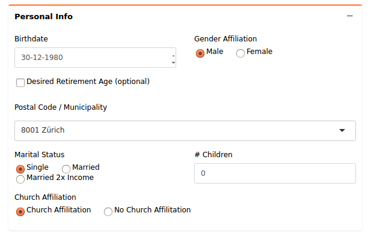

```{r setup, include = FALSE}
knitr::opts_chunk$set(
  collapse = TRUE,
  comment = "#>"
)

library(shiny)
```
## Introduction

Smart Retirement Planning (SmaRP) is an internal Mirai Solutions project aimed at creating a retirement plan for people working in Switzerland. 

This vignette describes the UI components and their inner-workings. It is programmed exclusively using shiny basic package and intended to be used with the mere support of a web browser. In addition to theoretical explanations, simplified versions of code are included; for the full version please check the ui.R file.  

## Outline

The ui script is wrapped inside a `fluiPage` divided into different `fluidRow`s, one for each component: header, Personal Info, Pillar II - III and plots and table. Every component is then organized into a combination of other `fluidRow`s and `column`s. 

## Header

The header is the first object starting from the top of the page and it includes a long, blue bar with the SmaRP logo and a title. 


These three objects are placed inside a `fluidRow` and divided into two columns: one containing the logo and the blue bar and the other the title. The blue bar and the logo is dragged from the Mirai Solutions website in the form of a URL and the logo as a .png image. A sample of the code is shown below:

```{r, eval = FALSE}
fluidRow(
  column(
    width,
    url_to_blue_bar,
    logo.png
  ),
  style = "margin-top: 10%; margin-bottom: 10%;",
  column(
    width=1,
    title
  ),
  style = "margin-left: 0%; margin-right: 0%;"
) 
```
where,

width represents the width of the column, which can range between 1 and 12
style determines where objects should be located.

## Personal Info

The personal Info panel gathers the user's personal data, later used to perform calculations. A snippet of the panel's outline can be found below



Each component is created using a specific shiny function, explained below:

* Personal Info: text object with `h4` dimensions
* Birthday: `dateInput` object with date-month-year format. The user can either select a date form the calendar or manually type it in
* Gender affiliation: group of `radioButtons`with "Male" as the pre-selected option, the user can only select one
* Desired retirement age: optional `checkbox` object. If selected, it will show additional objects to be filled 
* PLZ: in the form of a `selectInput` (dropdown) object. The user can either select a date from the drop-down menu or manually type it
* Marital Status:`radioButtons` group of 3
* Kids: `numericInput` object. The user can increase/decrease the number with the arrows or enter it manually; the default is zero
* Church affiliation: optional `checkbox` object.

Even though most components are self explanatory, `bsTooltip`s were added to provide short explanations. They appear in the form of a black box when the user places the cursor on a specific object. A sample of the code is shown below:

```{r, eval = FALSE}
fluidRow(
  fluidRow(
    column(
      width,
      dateInput("Birthdate", ...
      ),
      bsTooltip("Birthdate", ...
      )
    )
  )
)

```


## Pillar II and III

Below the personal info part lies the pillars section. Pillar II is intended for the case of an occupational pension fund and Pillar III for a private one.


They both contain `numericInput`s inside `fluidRow`s and a `radioButtons` in the case of Pillar II.

## Plots and table

On the right side, the ui has two interchangeable parts: two plots and a table. Only one of these can be shown at a time by clicking on the respective tab on the top-center. 

The first graph shows how much the retirement fund will increase over time, whereas the second displays percentage contributions from each pillar.

The table reports many output values including: calendar, DirectP2, ReturnP2, TotalP2, DirectP3,...

## Additional components

GitHub and Mirai Solutions logos were imported using urls. 

The disclaimer message was created using the `verbatimTextOutput` function as shown below:

```{r, eval = FALSE}
fluidRow(
  style = "margin-left: 60%; margin-bottom: 0.1%;",
  verbatimTextOutput("disclaimer")
)
```
